```{r,echo=FALSE, message=FALSE,warning=FALSE}
library(bulletr)
library(ggplot2)
library(knitr)
```

## Statistical and Algorithmic Approaches to Matching Bullets { .white }

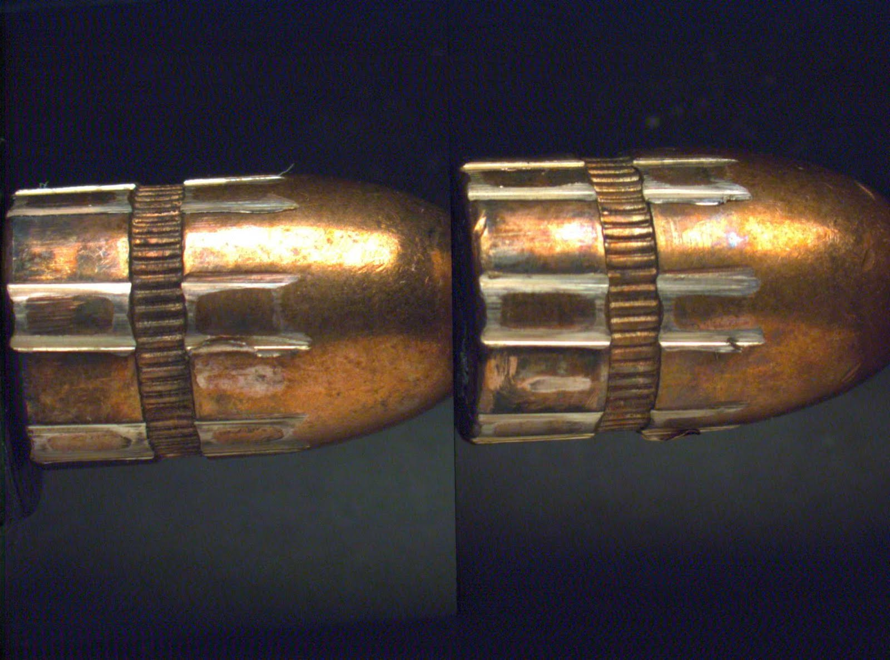
<br><br><br><br><br><br><br>
<p class="white">
Eric Hare, Heike Hofmann, Alicia Carriquiry<br />
Iowa State University<br />
April 14th, 2017
</p>

# Background

## Goal

- We wish to determine whether two bullets were fired from the same gun barrel
- Striation patterns, or individual characteristics, are unique to barrels and fairly stable (Xie 2009)
- Forensic Examiners shoot bullets from guns of suspects, compare it to bullet recovered from crime scene


## Bullet Surfaces

- These striations are imprinted on the **land impression** regions of the bullet surface
- The land/groove pattern is induced by the rifling of the barrel as the gun is fired.


## Current Practice

- Traditionally, the bullets are placed under comparison microscopes and manually aligned by forensic scientists so that they can be compared
- Match thresholds have been established as "standard practice" (e.g., more than 6 consecutively matching striae, @nichols:2003)
- However, this has traditionally been less than statistical and such practices have come under fire in the courtroom [@giannelli:2011]

2009 NAS report: *"much forensic evidence -- including, for example, bite marks and firearm and toolmark identification is introduced in criminal trials without any meaningful scientific validation, determination of error rates, or reliability testing."* [@NAS:2009]

## PCAST Report

From a September 2016 report by the President’s Council of Advisors on Science and Technology (PCAST) titled **Forensic Science in Criminal Courts: Ensuring Scientific Validity of Feature-Comparison Methods** [@pcast2016]:

    A second—and more important—direction is (as with latent print analysis) 
    to convert firearms analysis from a subjective method to an objective 
    method. This would involve developing and testing image-analysis 
    algorithms for comparing the similarity of tool marks on bullets. [...] 
    In a recent study, researchers used images from an earlier study to 
    develop a computer-assisted approach to match bullets that minimizes 
    human input [338].

338: Hare, E., Hofmann, H., and A. Carriquiry. “Automatic matching of bullet lands.” Unpublished paper, available at: arxiv.org/pdf/1601.05788v2.pdf.

# Automatic Matching of Bullet Lands

## Our Approach

- Using a *reference database* of 3D bullet scans, compute distributional differences between **known matches** (bullets known to be fired from the same gun barrel), and **known non-matches** (bullets known to be fired from different barrels)
- Derive a set of features which separate these two classes
- Use the features to train a statistical model
- Predict on unknown pairs of bullets the probability of being a match

The key to this approach is the *reference database*...

## James Hamby Study

- Ten consecutively rifled Ruger P-85 pistol barrels used to fire 20 "known" test bullets and 15 "unknown" bullets for comparison [@hamby:2009]
- Sets of 35 bullets sent to 507 Forensic Examiners for examination
- 0 false positive identifications, 8 inconclusive results (out of 7605)
- Can an automated algorithm do as well?

```{r, eval=FALSE}
plot3D.x3p.file(read_x3p("../images/Hamby (2009) Barrel/
                         bullets/Br1 Bullet 1-5.x3p"),
                plot.type = "surface")
```
    
## Data Format

- 3D topographical images of each bullet
- x3p format, array of surface measurements at the micrometer level
- R package *x3pr* available for working with these images (Nicholas Petraco, John Jay College, @x3pr)
- R package *bulletr* [@bulletr] with a more streamlined image reading routine and additional statistical functionality
- Each bullet is a set of 6 land-to-land scans


## Front-End Web Application

https://isu-csafe.stat.iastate.edu/shiny/bulletr/


## Step One: Extract a Profile

We need to choose a location (height) of the bullet at which to extract a profile. To do so, we optimize the  **CCF** [@vorburger:2011]:

1. Extract a profile near the base of the bullet, call this value $d_0$.
2. Take a fixed step $d$ and extract at $d + d_0$.
3. Check the maximum CCF between the signature at $d_0$ and at $d + d_0$.
4. If this CCF exceeds a threshold $c$, choose $d_0$ as the signature
5. Otherwise, repeat steps 2 to 4 for $d$, $2d$, $3d$, ... until the threshold is achieved.
6. If the threshold is not achieved, flag the land for further investigation.

Parameters: $d = 25\mu m, d_0 = 25\mu m, c = 0.9$

## Step One (Continued)

```{r, warning=FALSE, fig.height=4}
br111 <- get_crosscut("images/Br1 Bullet 1-5.x3p", x = 243.75)

qplot(y, value, data = br111) + theme_bw()
```

## Step Two: Remove Shoulders

The striations that identify a bullet to a gun barrel are located in the land impression areas [@xie:2009].

1. At a fixed height $x$ extract a bullet's profile (previous figure).
2. For each $y$ value, smooth out deviations near the shoulders by applying a rolling average with a pre-set **smoothing factor** (rolling window) $s$.
3. For each smoothed $y$ value, repeat step two.
4. Determine the location of the peak of the shoulders by finding the first and last doubly-smoothed value $y_i$ that is the maximum within its smoothing window.

Parameters: $s = 35\mu m$

## Identifying Shoulders (Easy)

```{r, message=FALSE, warning=FALSE, fig.height=4}
br111.groove <- get_grooves(br111)
br111.groove$plot
```

## Identifying Shoulders (Challenging)

```{r, message=FALSE, warning=FALSE, fig.height=4}
br116 <- "../images/Hamby (2009) Barrel/bullets/Br1 Bullet 1-6.x3p"
result2 <- get_grooves(get_crosscut(br116))
result2$plot
```

## Step Three: Fit Loess Regression

Local weighted scatterplot smoothing [@cleveland:1979] - Fits a low-degree polynomial to a small subset of the data, weighting values near the point to be estimated more strongly. 

```{r, warning=FALSE, fig.height=3, message=FALSE}
br111.loess <- fit_loess(br111, br111.groove)
br111.loess$fitted
```

## Step Four: Get the Residuals

Deviations from the loess fit should represent the imperfections (striations) on the bullet. Hence, we extract the residuals from the model.

```{r, warning=FALSE, fig.height=4}
br111.loess$resid
```

## Step Five: Peaks and Valleys

As with detecting the shoulders, we can smooth the deviations and compute derivatives to identify peaks and valleys in the signature.

```{r, warning=FALSE, fig.height=3}
br111.peaks <- get_peaks(br111.loess$data)
br111.peaks$plot
```

## Step Six: Bullet Alignment

The previous five steps are performed for each bullet land. But now we wish to extract features for cross comparisons of bullet lands.

```{r,echo=FALSE,message=FALSE,warning=FALSE, fig.height=4}
library(dplyr)

mypaths <- c("images/Br1 Bullet 1-5.x3p", "images/Br1 Bullet 2-1.x3p")
my_bullets <- lapply(mypaths, function(x) {
    result <- read_x3p(x)
    result[[3]] <- x
    names(result)[3] <- "path"
        
    return(result)
})
bullets_processed <- lapply(my_bullets, function(bul) {
    processBullets(bullet = bul, name = bul$path, x = 100)
})
names(bullets_processed) <- mypaths

bullets_smoothed <- bullets_processed %>% bind_rows %>% bulletSmooth

bAlign = bulletAlign(bullets_smoothed)
lofX <- bAlign$bullet  

b12 <- unique(bullets_smoothed$bullet)

peaks1 <- get_peaks(subset(lofX, bullet == b12[1]), smoothfactor = 25)
peaks2 <- get_peaks(subset(lofX, bullet == b12[2]), smoothfactor = 25)
peaks1$lines$bullet <- b12[1]
peaks2$lines$bullet <- b12[2]
peaks <- rbind(peaks1$lines, peaks2$lines)

ggplot() + theme_bw() +
    geom_rect(aes(xmin=xmin, xmax=xmax, fill=factor(type)), ymin=-6, ymax=6, 
              data=peaks,  alpha=0.2) +
    geom_vline(aes(xintercept=extrema, colour=factor(type)), 
               data= peaks, alpha=0.7) +
    scale_colour_brewer(palette="Set2") + 
    scale_fill_brewer(palette="Set2") +
    theme(legend.position="none") + 
    facet_grid(bullet~.) +
    geom_line(aes(x=y, y=l30, group=bullet), data=lofX) +
    ylab(expression(paste("Signatures (in ",mu,"m)", sep=""))) 
```

## Step Six (Continued)

```{r, echo=FALSE, warning=FALSE, fig.height=5}
peaks1$lines$bullet <- b12[1]
peaks2$lines$bullet <- b12[2]

lines <- striation_identify(peaks1$lines, peaks2$lines)

ggplot() + 
  geom_rect(aes(xmin = xmin, xmax = xmax, fill=factor(type)), ymin = -6, ymax=6.5,  data = lines, alpha=0.2, show.legend = FALSE) +
  theme(legend.position="bottom") +
  geom_text(aes(x = meany), y= -5.5, label= "x", data = subset(lines, !match)) +
  geom_text(aes(x = meany), y= -5.5, label= "o", data = subset(lines, match)) +
  ylim(c(-6,6.5)) + theme_bw() +
  geom_line(data=lofX, aes(x=y, y=l30, group=bullet, linetype=bullet)) +
  scale_linetype_discrete("") +
  scale_colour_manual("", values=cols) +
  scale_fill_brewer("", palette="Set2", na.value=alpha("grey60", 0.5)) +
    theme(legend.position = "bottom",
        legend.background = element_rect(fill=alpha('white', 0.4))) + 
  ylab(expression(paste("Signatures (in ",mu,"m)", sep=""))) +
  xlab("y")
```

## Step Six: Extract Features

Features are extracted from each land-to-land comparison:

- **ccf** (%) is the maximum value of the Cross-Correlation function evaluated at the optimal alignment. The CCF is defined as $C(\tau) = \int_{-\infty}^{\infty} f(t)g(t + \tau)dt$ where $\tau$ represents the the lag of the second signature [@vorburger:2011]. 
- **D** (mm) is the Euclidean vertical distance between each height value of the aligned signatures. This is defined as $D^2 = 1/n \times \sum_t (f(t) - g(t))^2$. Measure of the total variation [@clarkson1933definitions].
- **matches** is the number of matching peaks/valleys (striae) of the overlapping portion of the aligned signatures.

## More Features

- **mismatches** is the number of mismatching peaks/valleys (striae) of the overlapping portion of the aligned signatures.
- **cms** is the number of consecutively matching peaks/valleys (striae) of the overlapping portion of the aligned signatures [@biasotti:1959].
- **non_cms** is the number of consecutive mismatching peaks/valleys (striae) of the overlapping portion of the aligned signatures.
- **S** (mm) is the the sum of the average heights of matched striae.

## Distribution of Features

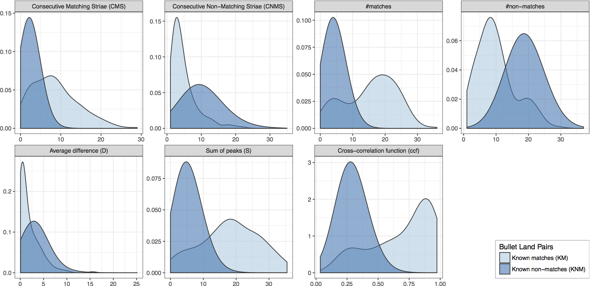

## Step Seven: Random Forest

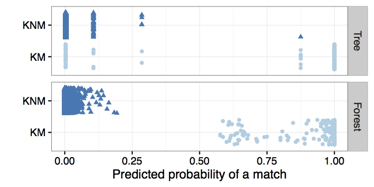

## Feature Importance

<br><br>

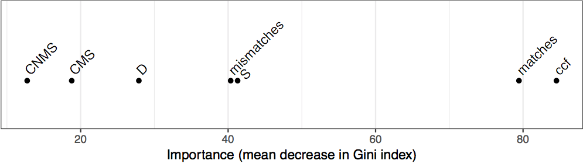

# Degraded Bullets

## Feature Standardization

To begin to tackle the degraded bullet problem, we need to standardize features by the length of the recovered land.

```{r,echo=FALSE,message=FALSE,warning=FALSE, fig.height=3}
library(dplyr)

mypaths <- c("images/Br1 Bullet 1-5.x3p", "images/Br1 Bullet 2-1.x3p")
my_bullets <- lapply(mypaths, function(x) {
    result <- read_x3p(x)
    result[[3]] <- x
    names(result)[3] <- "path"
        
    return(result)
})
bullets_processed <- lapply(my_bullets, function(bul) {
    processBullets(bullet = bul, name = bul$path, x = 100)
})
names(bullets_processed) <- mypaths

bullets_smoothed <- bullets_processed %>% bind_rows %>% bulletSmooth

bAlign = bulletAlign(bullets_smoothed)
lofX <- bAlign$bullet  

b12 <- unique(bullets_smoothed$bullet)

peaks1 <- get_peaks(subset(lofX, bullet == b12[1]), smoothfactor = 25)
peaks2 <- get_peaks(subset(lofX, bullet == b12[2]), smoothfactor = 25)
peaks1$lines$bullet <- b12[1]
peaks2$lines$bullet <- b12[2]
peaks <- rbind(peaks1$lines, peaks2$lines)

peaks$bullet <- gsub("images/", "", peaks$bullet)
peaks$bullet <- gsub(".x3p", "", peaks$bullet)

lofX$bullet <- gsub("images/", "", lofX$bullet)
lofX$bullet <- gsub(".x3p", "", lofX$bullet)

ggplot() + theme_bw() +
    geom_rect(aes(xmin=xmin, xmax=xmax, fill=factor(type)), ymin=-6, ymax=6, 
              data=peaks,  alpha=0.2) +
    geom_vline(aes(xintercept=extrema, colour=factor(type)), 
               data= peaks, alpha=0.7) +
    scale_colour_brewer(palette="Set2") + 
    scale_fill_brewer(palette="Set2") +
    theme(legend.position="none") + 
    facet_grid(bullet~.) +
    geom_line(aes(x=y, y=l30, group=bullet), data=lofX) +
    ylab(expression(paste("Signatures (in ",mu,"m)", sep=""))) 
```

Matches = 27, Matches per mm = 14.72

## True Degraded Case

By standardizing the features, we don't penalize the degraded case as in the first revision of our algorithm:

```{r,echo=FALSE,message=FALSE,warning=FALSE, fig.height=3}
library(dplyr)

mypaths <- c("images/Br1 Bullet 1-5.x3p", "images/Br1 Bullet 2-1.x3p")
my_bullets <- lapply(mypaths, function(x) {
    result <- read_x3p(x)
    result[[3]] <- x
    names(result)[3] <- "path"
        
    return(result)
})
bullets_processed <- lapply(my_bullets, function(bul) {
    processBullets(bullet = bul, name = bul$path, x = 100)
})
names(bullets_processed) <- mypaths

bullets_smoothed <- bullets_processed %>% bind_rows %>% bulletSmooth %>% filter((y > 0 & y < 1000 & bullet == "images/Br1 Bullet 2-1.x3p") | bullet == "images/Br1 Bullet 1-5.x3p")

bAlign = bulletAlign(bullets_smoothed)
lofX <- bAlign$bullet  

b12 <- unique(bullets_smoothed$bullet)

peaks1 <- get_peaks(subset(lofX, bullet == b12[1]), smoothfactor = 25)
peaks2 <- get_peaks(subset(lofX, bullet == b12[2]), smoothfactor = 25)
peaks1$lines$bullet <- b12[1]
peaks2$lines$bullet <- b12[2]
peaks <- rbind(peaks1$lines, peaks2$lines)

peaks$bullet <- gsub("images/", "", peaks$bullet)
peaks$bullet <- gsub(".x3p", "", peaks$bullet)

lofX$bullet <- gsub("images/", "", lofX$bullet)
lofX$bullet <- gsub(".x3p", "", lofX$bullet)

ggplot() + theme_bw() +
    geom_rect(aes(xmin=xmin, xmax=xmax, fill=factor(type)), ymin=-6, ymax=6, 
              data=peaks,  alpha=0.2) +
    geom_vline(aes(xintercept=extrema, colour=factor(type)), 
               data= peaks, alpha=0.7) +
    scale_colour_brewer(palette="Set2") + 
    scale_fill_brewer(palette="Set2") +
    theme(legend.position="none") + 
    facet_grid(bullet~.) +
    geom_line(aes(x=y, y=l30, group=bullet), data=lofX) +
    ylab(expression(paste("Signatures (in ",mu,"m)", sep=""))) 
```

Matches = 8, Matches per mm = 11.42

## Standardized Features

- **matches** (per mm) is the number of matching peaks/valleys (striae) per millimeter of the overlapping portion of the aligned signatures.
- **mismatches** (per mm) is the number of mismatching peaks/valleys (striae) per millimeter of the overlapping portion of the aligned signatures.
- **cms** (per mm) is the number of consecutively matching peaks/valleys (striae) per millimeter of the overlapping portion of the aligned signatures [@biasotti:1959, @thompson:2013].
- **non_cms** (per mm) is the number of consecutive mismatching peaks/valleys (striae) per millimeter of the overlapping portion of the aligned signatures.
- **S** (per mm) is the the sum of the average heights of matched striae.

## Roughness Correlation

Our algorithm had trouble in scenarios where large **deformations** in the two aligned signatures yielded a high CCF, when in fact the two land were not matches.

We fit a new loess fit to the **average of the two signatures**, and subtract the resulting fit from the original signatures - This models the "roughness" of the bullet land while removing the "waviness"

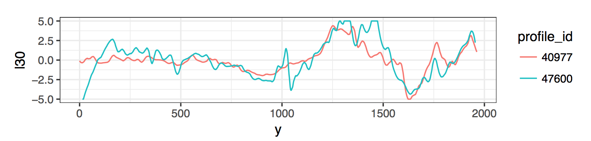

## Roughness Correlation (Continued)

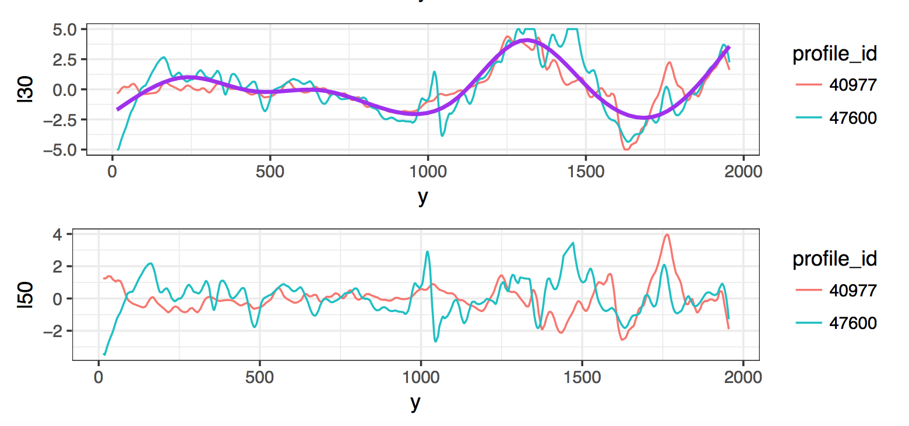

CCF: 0.7724 <br>
Roughness Correlation: -0.0324

## Roughness Correlation (Typical)

In the typical case of no major deformations, the roughness correlation remains similar to the CCF and the resulting profiles don't change much:

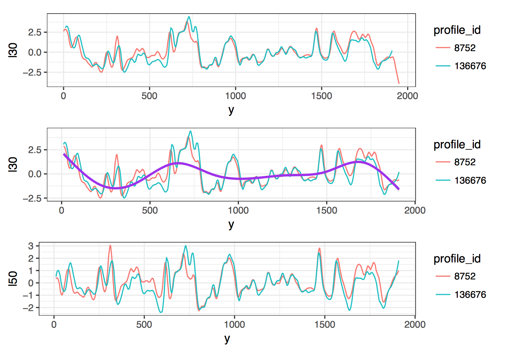

CCF: 0.6891 <br>
Roughness Correlation: 0.7980

## Roughness Correlation Distributions

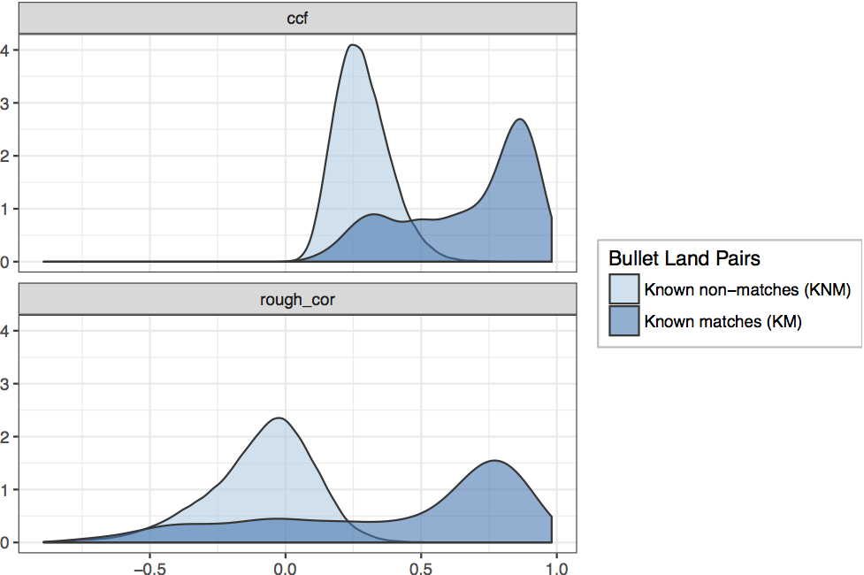

## Degraded Bullets

**Simulation Study**:

1. Three types of Degradation:
    a. Left Fixed - The left portion of the land (leading shoulder) is recoverable.
    b. Middle Fixed - The middle portion of the land is recoverable.
    c. Right Fixed - The right portion of the land (trailing shoulder) is recoverable.
2. Six Degradation Levels: 100% (Fully recovered), 87.5% Recovered, 75% Recovered, 62.5% Recovered, 50% Recovered, 25% Recovered.

## Simulation Results

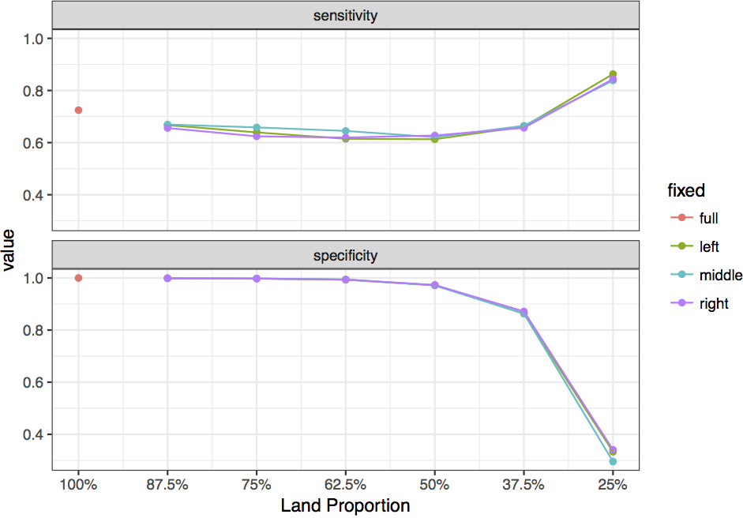

## Feature Expression

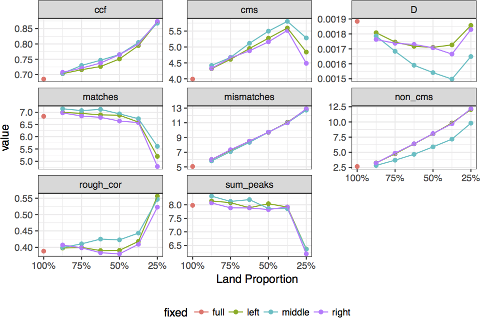

## Testing this Finding

To come full circle, we will attempt to extract a 50% degraded signature from a Hamby bullet land with band tank rash in one half. (Barrel 9 Bullet 2 Land 4):

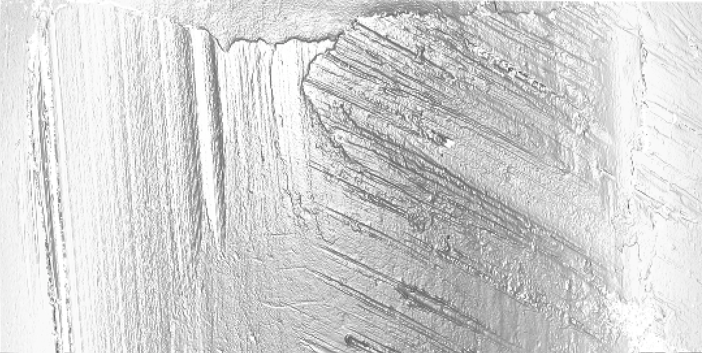

## Br924 Results

Extracting the ideal signature and then simulating a left-fixed 50% degradation scenario yields the following:

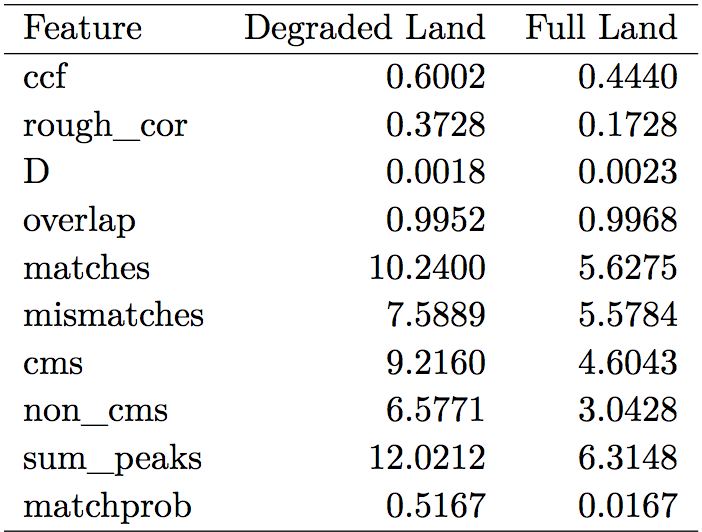

# Future Work

## Reference Database

By far the biggest limitation of these algorithms thus far is the limited amount of available 3D scan data for bullets:

- Hamby Set 252 (10 Barrels)
- Hamby Set 44 (Same 10 Barrels)
- Cary Persistence (1 Barrel)

11 unique gun barrels is not yet enough to form a true reference distribution for known matches and non-matches...

...However, the structure of the database means that as soon as new data is available, the features and scores can be easily recomputed.

## Parameter Optimization

Some work has been done to optimize the parameter choices (smoothing factor, optimal cross-section, etc.) But there are number of parameters which were chosen without cross-validation:

1. The CCF cut-off for the ideal cross section (.9)
2. The location to start the search for the ideal cross section (25 micrometers)
3. The roughness correlation LOESS span (.3)

Further, the parameters we did optimize were chosen to be **globally optimal** rather than for each individual land or cross-comparison of lands. This was done for computational efficiency.

## Thank You

Special thanks to Alan Zheng at the National Institute of Standards and Technology for maintaining the NIST Ballistics Toolmark Research Database and providing many useful suggestions for our algorithm.

- My GitHub: https://github.com/erichare
- My Website: http://erichare.me

Any Questions?

<br><br><br><br><br>
