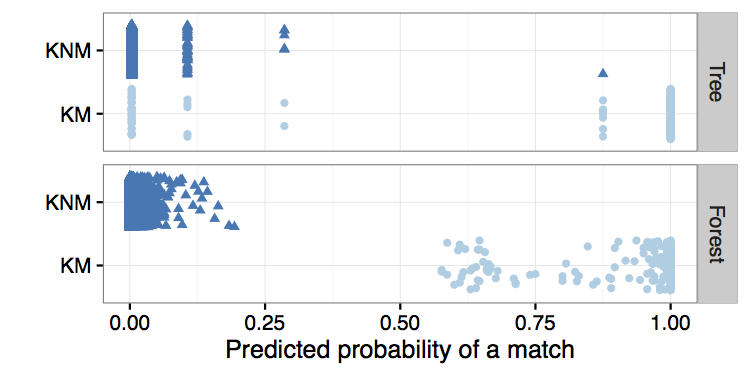
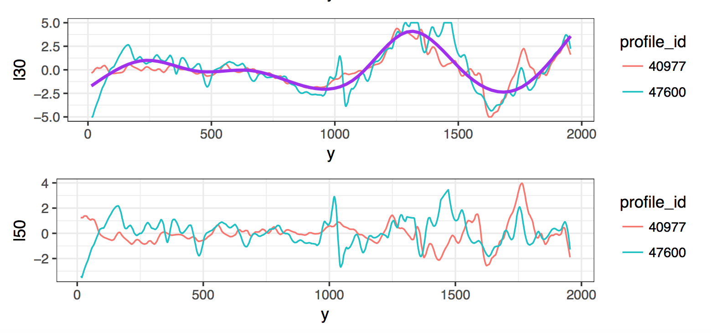
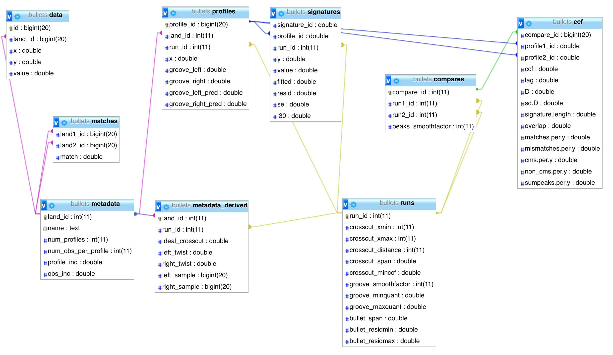

## Statistical Methods for Bullet Matching { .white }


<p class="white">
Eric Hare<br />
Iowa State University<br />
April 5th, 2017
</p>

## Dissertation Outline

**Statistical Methods for Bullet Matching**

Chapters:

1. Background
2. Automatic Matching of Bullet Lands
3. Bullet Land Feature Analysis
4. A Modern Bullet Matching Application
5. Future Work

# Dissertation Chapter One: Background

## Goal

- We wish to determine whether two bullets were fired from the same gun barrel
- Striation patterns, or individual characteristics, are unique to barrels and fairly stable (Xie 2009)
- Forensic Examiners shoot bullets from guns of suspects, compare it to bullet recovered from crime scene


## Current Practice

- Traditionally, the bullets are placed under comparison microscopes and manually aligned by forensic scientists so that they can be compared
- (Arbitrary) match thresholds have been established as "standard practice" (e.g., more than 6 consecutively matching striae, @nichols:2003)
- However, this has traditionally been less than statistical and such practices have come under fire in the courtroom [@giannelli:2011]

The problems culminated in a 2009 NAS report which found *"much forensic evidence -- including, for example, bite marks and firearm and toolmark identification is introduced in criminal trials without any meaningful scientific validation, determination of error rates, or reliability testing."* [@NAS:2009]

## PCAST Report

From a September 2016 report by the President’s Council of Advisors on Science and Technology (PCAST) titled **Forensic Science in Criminal Courts: Ensuring Scientific Validity of Feature-Comparison Methods** [@pcast2016]:

    A second—and more important—direction is (as with latent print analysis) 
    to convert firearms analysis from a subjective method to an objective 
    method. This would involve developing and testing image-analysis 
    algorithms for comparing the similarity of tool marks on bullets. [...] 
    In a recent study, researchers used images from an earlier study to 
    develop a computer-assisted approach to match bullets that minimizes 
    human input [338].

338: Hare, E., Hofmann, H., and A. Carriquiry. “Automatic matching of bullet lands.” Unpublished paper, available at: arxiv.org/pdf/1601.05788v2.pdf.

# Dissertation Chapter Two

## Automatic Matching of Bullet Lands


<p class="black">
Eric Hare, Heike Hofmann, Alicia Carriquiry<br/>
Center for Statistics and Applications in Forensic Evidence (CSAFE)<br/>
</p>

```{r,echo=FALSE, message=FALSE,warning=FALSE}
library(bulletr)
library(ggplot2)
library(knitr)
```

## Our Approach

- Using a *reference database* of 3D bullet scans, compute distributional differences between **known matches** (bullets known to be fired from the same gun barrel), and **known non-matches** (bullets known to be fired from different barrels)
- Derive a set of features which separate these two classes
- Use the features to train a statistical model
- Predict on unknown pairs of bullets the probability of being a match

The key to this approach is the *reference database*...

## James Hamby Study

- Ten consecutively rifled Ruger P-85 pistol barrels used to fire 20 "known" test bullets and 15 "unknown" bullets for comparison [@hamby:2009]
- Sets of 35 bullets sent to 507 Forensic Examiners for examination
- 0 false positive identifications, 8 inconclusive results (out of 7605)
- Can an automated algorithm do as well?

```{r, eval=FALSE}
plot3D.x3p.file(read_x3p("../images/Hamby (2009) Barrel/bullets/Br1 Bullet 1-5.x3p"),
plot.type = "surface")
```
    
## Data Format

- 3D topographical images of each bullet
- x3p format, array of surface measurements at the micrometer level
- R package *x3pr* available for working with these images (Nicholas Petraco, John Jay College, @x3pr)
- R package *bulletr* [@bulletr] with a more streamlined image reading routine and additional statistical functionality
- Each bullet is a set of 6 land-to-land scans


## Front-End Web Application

https://isu-csafe.stat.iastate.edu/shiny/bulletr/


## Step One: Extract a Profile

We need to choose a location (height) of the bullet at which to extract a profile. To do so, we optimize the  **CCF** [@vorburger:2011]:

1. Extract a profile near the base of the bullet, call this value $d_0$.
2. Take a fixed step $d$ and extract at $d + d_0$.
3. Check the maximum cross correlation (CCF) between the signature at $d_0$ and at $d + d_0$.
4. If this CCF exceeds a threshold $c$, choose $d_0$ as the signature
5. Otherwise, repeat steps 2 to 4 for $d$, $2d$, $3d$, ... until the threshold is achieved.
6. If the threshold is not achieved, flag the land for further investigation.

Parameters: $d = 25\mu m, d_0 = 25\mu m, c = 0.9$

## Step One (Continued)

```{r, warning=FALSE}
br111 <- get_crosscut("images/Br1 Bullet 1-5.x3p", x = 243.75)

qplot(y, value, data = br111) + theme_bw()
```

## Step Two: Remove Shoulders

The striations that identify a bullet to a gun barrel are located in the land impression areas [@xie:2009].

1. At a fixed height $x$ extract a bullet's profile (previous figure, with $x = 243.75\mu m$).
2. For each $y$ value, smooth out any deviations occurring near the minima by applying a rolling average with a pre-set \emph{smoothing factor} $s$.
3. For each smoothed $y$ value, compute another rolling average using the same smoothing factor $s$ as above.
4. Determine the location of the peak of the shoulders by finding the first and last doubly-smoothed value $y_i$ that is the maximum within its smoothing window.

Parameters: $s = 35\mu m$

## Identifying Shoulders (Easy)

```{r, message=FALSE, warning=FALSE}
br111.groove <- get_grooves(br111)
br111.groove$plot
```

## Identifying Shoulders (Challenging)

```{r, message=FALSE, warning=FALSE}
result2 <- get_grooves(get_crosscut("../images/Hamby (2009) Barrel/bullets/Br1 Bullet 1-6.x3p"))
result2$plot
```

## Step Three: Fit Loess Regression

Local weighted scatterplot smoothing [@cleveland:1979] - Fits a low-degree polynomial to a small subset of the data, weighting values near the point to be estimated more strongly. 

```{r, warning=FALSE, fig.height=3, message=FALSE}
br111.loess <- fit_loess(br111, br111.groove)
br111.loess$fitted
```

## Step Four: Get the Residuals

Deviations from the loess fit should represent the imperfections (striations) on the bullet. Hence, we extract the residuals from the model.

```{r, warning=FALSE, fig.height=4}
br111.loess$resid
```

## Step Five: Peaks and Valleys

As with detecting the shoulders, we can smooth the deviations and compute derivatives to identify peaks and valleys in the signature.

```{r, warning=FALSE, fig.height=4}
br111.peaks <- get_peaks(br111.loess$data)
br111.peaks$plot
```

## Step Six: Bullet Alignment

The previous five steps are performed for each bullet land. But now we wish to extract features for cross comparisons of bullet lands.

```{r,echo=FALSE,message=FALSE,warning=FALSE}
library(dplyr)

mypaths <- c("images/Br1 Bullet 1-5.x3p", "images/Br1 Bullet 2-1.x3p")
my_bullets <- lapply(mypaths, function(x) {
    result <- read_x3p(x)
    result[[3]] <- x
    names(result)[3] <- "path"
        
    return(result)
})
bullets_processed <- lapply(my_bullets, function(bul) {
    processBullets(bullet = bul, name = bul$path, x = 100)
})
names(bullets_processed) <- mypaths

bullets_smoothed <- bullets_processed %>% bind_rows %>% bulletSmooth

bAlign = bulletAlign(bullets_smoothed)
lofX <- bAlign$bullet  

b12 <- unique(bullets_smoothed$bullet)

peaks1 <- get_peaks(subset(lofX, bullet == b12[1]), smoothfactor = 25)
peaks2 <- get_peaks(subset(lofX, bullet == b12[2]), smoothfactor = 25)
peaks1$lines$bullet <- b12[1]
peaks2$lines$bullet <- b12[2]
peaks <- rbind(peaks1$lines, peaks2$lines)

ggplot() + theme_bw() +
    geom_rect(aes(xmin=xmin, xmax=xmax, fill=factor(type)), ymin=-6, ymax=6, 
              data=peaks,  alpha=0.2) +
    geom_vline(aes(xintercept=extrema, colour=factor(type)), 
               data= peaks, alpha=0.7) +
    scale_colour_brewer(palette="Set2") + 
    scale_fill_brewer(palette="Set2") +
    theme(legend.position="none") + 
    facet_grid(bullet~.) +
    geom_line(aes(x=y, y=l30, group=bullet), data=lofX) +
    ylab(expression(paste("Signatures (in ",mu,"m)", sep=""))) 
```

## Step Six (Continued)

```{r, echo=FALSE, warning=FALSE}
peaks1$lines$bullet <- b12[1]
peaks2$lines$bullet <- b12[2]

lines <- striation_identify(peaks1$lines, peaks2$lines)

ggplot() + 
  geom_rect(aes(xmin = xmin, xmax = xmax, fill=factor(type)), ymin = -6, ymax=6.5,  data = lines, alpha=0.2, show.legend = FALSE) +
  theme(legend.position="bottom") +
  geom_text(aes(x = meany), y= -5.5, label= "x", data = subset(lines, !match)) +
  geom_text(aes(x = meany), y= -5.5, label= "o", data = subset(lines, match)) +
  ylim(c(-6,6.5)) + theme_bw() +
  geom_line(data=lofX, aes(x=y, y=l30, group=bullet, linetype=bullet)) +
  scale_linetype_discrete("") +
  scale_colour_manual("", values=cols) +
  scale_fill_brewer("", palette="Set2", na.value=alpha("grey60", 0.5)) +
    theme(legend.position = c(1,1.1), legend.justification=c(1,1),
        legend.background = element_rect(fill=alpha('white', 0.4))) + 
  ylab(expression(paste("Signatures (in ",mu,"m)", sep=""))) +
  xlab("y")
```

## Step Six: Extract Features

Features are extracted from each land-to-land comparison:

- **ccf** (%) is the maximum value of the Cross-Correlation function evaluated at the optimal alignment. The CCF is defined as $C(\tau) = \int_{-\infty}^{\infty} f(t)g(t + \tau)dt$ where $\tau$ represents the the lag of the second signature [@vorburger:2011]. 
- **D** (mm) is the Euclidean vertical distance between each height value of the aligned signatures. This is defined as $D^2 = 1/n \times \sum_t (f(t) - g(t))^2$. This is a measure of the total variation between two functions [@clarkson1933definitions].
- **matches** is the number of matching peaks/valleys (striae) of the overlapping portion of the aligned signatures.

## More Features

- **mismatches** is the number of mismatching peaks/valleys (striae) of the overlapping portion of the aligned signatures.
- **cms** is the number of consecutively matching peaks/valleys (striae) of the overlapping portion of the aligned signatures [@biasotti:1959, @thompson:2013].
- **non_cms** is the number of consecutive mismatching peaks/valleys (striae) of the overlapping portion of the aligned signatures.
- **sum_peaks** is the the sum of the average heights of matched striae.

## Distribution of Features


## Step Seven: Random Forest



## Feature Importance


# Dissertation Chapter Three: Degraded Bullets

## Feature Standardization

To begin to tackle the degraded bullet problem, we need to standardize features by the length of the recovered land.

```{r,echo=FALSE,message=FALSE,warning=FALSE, fig.height=3}
library(dplyr)

mypaths <- c("images/Br1 Bullet 1-5.x3p", "images/Br1 Bullet 2-1.x3p")
my_bullets <- lapply(mypaths, function(x) {
    result <- read_x3p(x)
    result[[3]] <- x
    names(result)[3] <- "path"
        
    return(result)
})
bullets_processed <- lapply(my_bullets, function(bul) {
    processBullets(bullet = bul, name = bul$path, x = 100)
})
names(bullets_processed) <- mypaths

bullets_smoothed <- bullets_processed %>% bind_rows %>% bulletSmooth

bAlign = bulletAlign(bullets_smoothed)
lofX <- bAlign$bullet  

b12 <- unique(bullets_smoothed$bullet)

peaks1 <- get_peaks(subset(lofX, bullet == b12[1]), smoothfactor = 25)
peaks2 <- get_peaks(subset(lofX, bullet == b12[2]), smoothfactor = 25)
peaks1$lines$bullet <- b12[1]
peaks2$lines$bullet <- b12[2]
peaks <- rbind(peaks1$lines, peaks2$lines)

ggplot() + theme_bw() +
    geom_rect(aes(xmin=xmin, xmax=xmax, fill=factor(type)), ymin=-6, ymax=6, 
              data=peaks,  alpha=0.2) +
    geom_vline(aes(xintercept=extrema, colour=factor(type)), 
               data= peaks, alpha=0.7) +
    scale_colour_brewer(palette="Set2") + 
    scale_fill_brewer(palette="Set2") +
    theme(legend.position="none") + 
    facet_grid(bullet~.) +
    geom_line(aes(x=y, y=l30, group=bullet), data=lofX) +
    ylab(expression(paste("Signatures (in ",mu,"m)", sep=""))) 
```

Matches = 27, Matches per mm = 14.72

## True Degraded Case

By standardizing the features, we don't penalize the degraded case as in the first revision of our algorithm:

```{r,echo=FALSE,message=FALSE,warning=FALSE, fig.height=3}
library(dplyr)

mypaths <- c("images/Br1 Bullet 1-5.x3p", "images/Br1 Bullet 2-1.x3p")
my_bullets <- lapply(mypaths, function(x) {
    result <- read_x3p(x)
    result[[3]] <- x
    names(result)[3] <- "path"
        
    return(result)
})
bullets_processed <- lapply(my_bullets, function(bul) {
    processBullets(bullet = bul, name = bul$path, x = 100)
})
names(bullets_processed) <- mypaths

bullets_smoothed <- bullets_processed %>% bind_rows %>% bulletSmooth %>% filter((y > 0 & y < 1000 & bullet == "images/Br1 Bullet 2-1.x3p") | bullet == "images/Br1 Bullet 1-5.x3p")

bAlign = bulletAlign(bullets_smoothed)
lofX <- bAlign$bullet  

b12 <- unique(bullets_smoothed$bullet)

peaks1 <- get_peaks(subset(lofX, bullet == b12[1]), smoothfactor = 25)
peaks2 <- get_peaks(subset(lofX, bullet == b12[2]), smoothfactor = 25)
peaks1$lines$bullet <- b12[1]
peaks2$lines$bullet <- b12[2]
peaks <- rbind(peaks1$lines, peaks2$lines)

ggplot() + theme_bw() +
    geom_rect(aes(xmin=xmin, xmax=xmax, fill=factor(type)), ymin=-6, ymax=6, 
              data=peaks,  alpha=0.2) +
    geom_vline(aes(xintercept=extrema, colour=factor(type)), 
               data= peaks, alpha=0.7) +
    scale_colour_brewer(palette="Set2") + 
    scale_fill_brewer(palette="Set2") +
    theme(legend.position="none") + 
    facet_grid(bullet~.) +
    geom_line(aes(x=y, y=l30, group=bullet), data=lofX) +
    ylab(expression(paste("Signatures (in ",mu,"m)", sep=""))) 
```

Matches = 8, Matches per mm = 11.42

## Standardized Features

Features are extracted from each land-to-land comparison:

- **ccf** (%) is the maximum value of the Cross-Correlation function evaluated at the optimal alignment. The CCF is defined as $C(\tau) = \int_{-\infty}^{\infty} f(t)g(t + \tau)dt$ where $\tau$ represents the the lag of the second signature [@vorburger:2011]. 
- **D** (mm) is the Euclidean vertical distance between each height value of the aligned signatures. This is defined as $D^2 = 1/n \times \sum_t (f(t) - g(t))^2$. This is a measure of the total variation between two functions [@clarkson1933definitions].
- **matches** (per mm) is the number of matching peaks/valleys (striae) per millimeter of the overlapping portion of the aligned signatures.

## More Features

- **mismatches** (per mm) is the number of mismatching peaks/valleys (striae) per millimeter of the overlapping portion of the aligned signatures.
- **cms** (per mm) is the number of consecutively matching peaks/valleys (striae) per millimeter of the overlapping portion of the aligned signatures [@biasotti:1959, @thompson:2013].
- **non_cms** (per mm) is the number of consecutive mismatching peaks/valleys (striae) per millimeter of the overlapping portion of the aligned signatures.
- **sum_peaks** (per mm) is the the sum of the average heights of matched striae.

## Roughness Correlation

Our algorithm had trouble in scenarios where large **deformations** in the two aligned signatures yielded a high CCF, when in fact the two land were not matches.

We fit a new loess fit to the **average of the two signatures**, and subtract the resulting fit from the original signatures - This models the "roughness" of the bullet land while removing the "waviness"


## Roughness Correlation (Continued)



## Degraded Bullets

**Simulation Study**:

1. Three types of Degradation:
    a. Left Fixed - The left portion of the land (leading shoulder) is recoverable
    b. Middle Fixed - The middle portion of the land is recoverable
    c. Right Fixed - The right portion of the land (trailing shoulder) is recoverable
2. Six Degradation Levels: 100% (Fully recovered), 87.5% Recovered, 75% Recovered, 62.5% Recovered, 50% Recovered, 25% Recovered
    
## Simulation Caveats

We simulated the degradation of the **processed signatures** rather than simulating a degraded surface.

This means that the recovered signature may have been slightly influenced by points that were removed in the simulation, though this effect is likely to be minor

## Simulation Results


## Feature Expression


## Testing this Finding

This confirms a NIST theory that the leading shoulder of the bullet better expresses striations as it travels through the barrel. To further test this, we can attempt to match a previously excluded land (due to severe tank rash) to its known match.


## Br924 Results

Extracting the ideal signature and then simulating a left-fixed 50% degradation scenario yields the following:


# Thank You

## Previous Future Work

Verbatim from September:

- We are extremely limited by data here - Currently we've only assessed this algorithm on one particular set of 35 bullets
- There is likely an effect from the equipment used to scan the bullets, or the person performing the scan, and this should be accounted for
- We need to assess the quality of the algorithm in case we don't have full bullet lands available, as is the case in many forensics applications (degraded bullets)
- This future work will be part of a follow-up paper, in progress.

We have steps to address each of these concerns...

## Data Limitation

NIST has provided some more data:

1. Hamby (Set 44) - These are the same barrels that were used for the Hamby study, but the bullets were scanned by a different person which allows us to provide an initial assessment of operator or scan quality effects
2. Cary Persistence - Repeated test fires from a single gun barrel
3. Our own microscope - We have installed a Sensofar 3D imaging microscope at Iowa State, and will soon begin a controlled study with numerous barrels and bullets.

## Operator Effects

With two studies, Hamby 252 and Hamby 44, there are three sets of cross comparisons we perform:

1. Hamby 252 to Hamby 252
2. Hamby 252 to Hamby 44
3. Hamby 44 to Hamby 44

Given that the barrels are the same in each case, assuming perfect scans and no microscope operator effects, each set of comparisons should be indistinguishable from one another.

## Feature Expression by Study


## Ideal Cross-Section by Study


## From Lands to Bullets

In a real world forensic application of these algorithms, the true experimental unit is the **bullet** rather than the **land**

- We focused on land-to-land comparisons to make the task more difficult
- However, we can generalize to full bullets in a few different ways (with varying success)

## Bullet Method 1

Idea: Two bullets $b_1$ and $b_2$ are matches if and only if some land $l_{b1}$ from $b_1$ matches some land $l_{b2}$ from bullet 2.
Corollary: Two bullets are non-matches if and only if no land from $b_1$ matches a land from $b_2$.
Assumptions: Each land on a bullet is independent of each other land

$$
\begin{align}
P(M) &= 1 - P(NM) \\
     &= 1 - (P(NM1) \times P(NM2) \times ... \times P(NM6)) \\
     &= 1 - ((1 - P(M1)) \times (1 - P(M2)) \times ... \times (1 - P(M6)))
\end{align}
$$

## Exploiting the Alignment

The true alignment of the lands exists along one of 6 diagonals:


Therefore, we can multiply the probabilities across the diagonals and take the highest for each bullet to bullet comparison [@sensorfar]

## Bullet to Bullet Results


## Bullet Method 2

Assuming bullets match if and only if all lands match:


Performance is weaker in this case because our algorithm is much more likely to make false negatives compared to false positives.

## Bullet Method 3: Hybrid

Average the scores along the maximal diagonal


We once again achieve much clearer separation.

# Dissertation Chapter Four: Bullet Application

## Software Design Principles

In Designing Modular Software: A Case Study in Introductory Statistics, we outlined several software design principles:

1. Modularity
2. Reproducibility
3. Extensibility
4. Residing on the Web

To truly open these bullet matching methods to the scientific community, we had to focus on a system which adheres to these principles

## Database

The underlying technology we've created since September is a brand new database which modularizes the algorithm and allows collaboration on individual components. The database:

1. Stores all parameters used in each run of the algorithm
2. Keeps track of intermediate results (profiles, signatures, etc.)
3. Is structured to allow seamless running and re-running of the algorithm
4. Allows researchers to extract the relevant components for their own research

## Structure



## Live Demo

https://isu-csafe.stat.iastate.edu/phpmyadmin

## Back-End Web Application

https://isu-csafe.stat.iastate.edu/shiny/bullets/


# Dissertation Chapter Five: Future Work

## Reference Database

By far the biggest limitation of these algorithms thus far is the limited amount of available 3D scan data for bullets

- Hamby Set 252 (10 Barrels)
- Hamby Set 44 (Same 10 Barrels)
- Cary Persistence (1 Barrel)

11 unique gun barrels is not yet enough to form a true reference distribution for known matches and non-matches...

...However, the structure of the database means that as soon as new data is available, the features and scores can be easily recomputed.

## Parameter Optimization

Some work has been done to optimize the parameter choices (smoothing factor, optimal cross-section, etc.) But there are number of parameters which were chosen without cross-validation:

1. The CCF cut-off for the ideal cross section (.9)
2. The location to start the search for the ideal cross section (25 micrometers)
3. The roughness correlation LOESS span (.3)

Further, the parameters we did optimize were chosen to be **globally optimal** rather than for each individual land or cross-comparison of lands. This was done for computational efficiency.

## Operator Effects Handling

While we showed the presence of operator effects, we didn't provide many recommendations for addressing this. Some possible solutions:

1. Rigorous and documented procedures for scanning bullet lands
2. Modeling the operator effect
3. Enforcing a quality standard prior to including in the algorithm (we did this, to a degree.)

As Iowa State University and NIST continue to collaborate, we will likely have several more individuals scanning and uploading surface scans of bullets, and this will need to be further investigated to ensure the algorithms withstand the real-world scenario of a wide variety of scan quality.

# About Me

## Education

- Graduated in 2008 from Snohomish High School in Snohomish, WA (1 Hour Northeast of Seattle)
- Bachelor of Science with a major in Statistics (University of Washington, June 2012)
- Bachelor of Science in Computer Engineering (University of Washington, June 2012)
- Began graduate studies at Iowa State University in August 2012
- Master of Science in Statistics (Iowa State University, 2014)
- Declared Co-Major in Statistics and Computer Science, 2014
- Accepted a job as Chief Data Scientist at Omni Analytics Group

## Publications

- Hare, E., Hofmann, H., and Carriquiry, A., **Automatic Matching of Bullet Lands**. Submitted to AoAS
- Hare, E., and Kaplan, A., **Introductory Statistics with intRo**. Accepted by JCGS
- Hare, E., Buja, A., and Hofmann, H., **Manipulation of Discrete Random Variables with discreteRV**. R Journal Vol. 7 Iss. 1 (2015)
- Sieber, T., Hare, E., Hofmann, H., and Treppel, M., **Biomathematical description of synthetic Peptide libraries**. PLOS One Vol. 10 Iss. 6 (2015)
- Kaplan, A., and Hare, E., Putting Down Roots: **A Graphical Exploration of Community Attachment** (Accepted in Computational Statistics)
- Kaplan, A., Hare, E., Hofmann, H., and Cook, D., **Can you buy a president? Politics after the Tillman Act**. CHANCE Vol. 27 Iss. 1 (2014)

## Thank You

Special thanks to Alan Zheng at the National Institute of Standards and Technology for maintaining the NIST Ballistics Toolmark Research Database and providing many useful suggestions for our algorithm.

- My GitHub: https://github.com/erichare
- My Website: https://erichare.me

Any Questions?

## Bibliography
