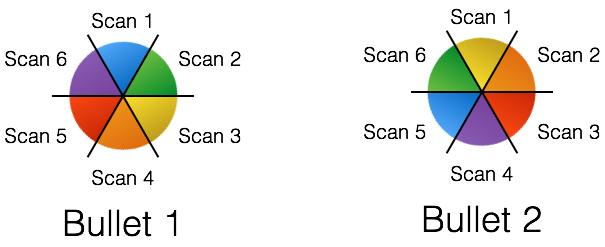

## Enabling Scientists to Understand their Data using Web-Based Statistical Tools { .white }


<p class="white">
Eric Hare<br />
Iowa State University<br />
September 23rd, 2016
</p>

# Background

## About Me

- Graduated in 2008 from Snohomish High School in Snohomish, WA (Hour Northeast of Seattle)
- Bachelor of Science with a major in Statistics (University of Washington, June 2012)
- Bachelor of Science in Computer Engineering (University of Washington, June 2012)
- Began graduate studies at Iowa State University in August 2012
- Master of Science in Statistics (Iowa State University, 2014)
- Declared Co-Major in Statistics and Computer Science, 2014
- Plan to graduate May 2017 and join Omni Analytics Group as Executive Data Scientist

## Publications

- Hare, E., Hofmann, H., and Carriquiry, A., **Automatic Matching of Bullet Lands**. Accepted by AoAS
- Hare, E., and Kaplan, A., **Introductory Statistics with intRo**. Accepted by JCGS
- Hare, E., Buja, A., and Hofmann, H., **Manipulation of Discrete Random Variables with discreteRV**. R Journal Vol. 7 Iss. 1 (2015)
- Sieber, T., Hare, E., Hofmann, H., and Treppel, M., **Biomathematical description of synthetic Peptide libraries**. PLOS One Vol. 10 Iss. 6 (2015)
- Kaplan, A., and Hare, E., Putting Down Roots: **A Graphical Exploration of Community Attachment** (Accepted in Computational Statistics)
- Kaplan, A., Hare, E., Hofmann, H., and Cook, D., **Can you buy a president? Politics after the Tillman Act**. CHANCE Vol. 27 Iss. 1 (2014)

## Awards

- ASA Imaging Section Student Paper Award, Automatic Matching of Bullet Lands, Received 2016
- Ron Wasserstein Award for Best Contributed Paper in Statistical Education, Introductory Statistics with intRo, Received 2015
- ASA Computing Section Student Paper Award, Introductory Statistics with intRo, Received 2015
- Kempthorne Award for Best Student in Linear Models, Received 2013
- ASA Data Exposition - 1st Place, Received 2013

## Dissertation Outline

Working Title: Enabling Scientists to Understand their Data using Web-Based Statistical Tools

Papers:

1. Automatic Matching of Bullet Lands (Accepted with Revisions in AoAS)
2. Designing Modular Software: A Case Study in Introductory Statistics (Accepted with Revisions in JCGS)
3. Visual Inference (In Progress)

## Common Themes

1. Reproducible Research
2. Interactive Graphics
3. Exploratory Data Analysis
4. Three-pronged approach:
    a. Statistical Component (Algorithm, optimization, lineup protocol) 
    b. Data Science Component (Open-source R packages)
    c. Web-Based Component (Interface for non-developers)

# Dissertation Chapter One

## Automatic Matching of Bullet Lands


<p class="black">
Eric Hare, Heike Hofmann, Alicia Carriquiry<br/>
Center for Statistics and Applications in Forensic Evidence (CSAFE)<br/>
</p>

```{r,echo=FALSE, message=FALSE,warning=FALSE}
library(x3pr)
library(x3prplus)
library(ggplot2)
library(knitr)
```

## Goal

- We wish to determine whether two bullets were fired from the same gun barrel
- Striation patterns, or individual characteristics, are unique to barrels and fairly stable (Xie 2009)
- Forensic Examiners shoot bullets from guns of suspects, compare it to bullet from crime scene


## Current Practice

- Traditionally, the bullets are placed under comparison microscopes, are manually aligned by forensic scientists and compared
- (Arbitrary) Thresholds have been established as "standard practice" (e.g., more than 6 consecutively matching striae to declare a match, Nichols 2003)
- However, this has traditionally been less than statistical and such practices have come under fire in the courtroom (Giannelli, 2011)

The problems culminated in a 2009 NAS report which found, among other things, *"much forensic evidence -- including, for example, bite marks and firearm and toolmark identification is introduced in criminal trials without any meaningful scientific validation, determination of error rates, or reliability testing to explain the limits of the discipline."*

## More Problems

A timely report was released on Tuesday by the President’s Council of Advisors on Science and Technology (PCAST) titled **Forensic Science in Criminal Courts: Ensuring Scientific Validity of Feature-Comparison Methods**.

    A second—and more important—direction is (as with latent print analysis) 
    to convert firearms analysis from a subjective method to an objective 
    method. This would involve developing and testing image-analysis 
    algorithms for comparing the similarity of tool marks on bullets. [...] 
    In a recent study, researchers used images from an earlier study to 
    develop a computer-assisted approach to match bullets that minimizes 
    human input [338].

338: Hare, E., Hofmann, H., and A. Carriquiry. “Automatic matching of bullet lands.” Unpublished paper, available at: arxiv.org/pdf/1601.05788v2.pdf.

## James Hamby Study

- Ten consecutively rifled Ruger P-85 pistol barrels used to fire 20 "known" test bullets and 15 "unknown" bullets for comparison
- Sets of 35 bullets sent to 507 Forensic Examiners for examination
- 0 false positive identifications, 8 inconclusive results (out of 7605)
- Can an automated algorithm do as well?

```{r, eval=FALSE}
plot3D.x3p.file(read.x3p("~/GitHub/imaging-paper/
app/images/Hamby252_3DX3P1of2/Br1 Bullet 1-5.x3p"),
plot.type = "surface")
```
    
## Data Format

- 3D topographical images of each bullet
- x3p format, array of surface measurements at the micrometer level
- R package x3pr available for working with these images (Nicholas Petraco, John Jay College)
- R package x3prplus is our additional functions to perform this analysis
- Each bullet is a set of 6 land-to-land scans



## Step One: Extract a Profile

We need to choose a location (height) of the bullet at which to extract a profile. To do so, we optimize the  **CCF** (Vorburger, 2011):

1. Extract a profile near the base of the bullet, call this value $d_0$.
2. Take a fixed step $d$ and extract at $d + d_0$.
3. Check the maximum cross correleation (CCF) between the signature at $d_0$ and at $d + d_0$.
4. If this CCF exceeds a threshold $c$, choose $d_0$ as the signature
5. Otherwise, repeat steps 2 to 4 for $d$, $2d$, $3d$, ... until the threshold is achieved.
6. If the threshold is not achieved, flag the land for further investigation.

Parameters: $d = 25\mu m, d_0 = 25\mu m, c = 0.9$

## Step One (Continued)

```{r, warning=FALSE}
br111 <- get_crosscut("images/Br1 Bullet 1-5.x3p", x = 243.75)

qplot(y, value, data = br111) + theme_bw()
```

## Step Two: Remove Shoulders

The striations that identify a bullet to a gun barrel are located in the land impression areas (Xie 2009).

1. At a fixed height $x$ extract a bullet's profile (previous figure, with $x = 243.75\mu m$).
2. For each $y$ value, smooth out any deviations occurring near the minima by applying a rolling average with a pre-set \emph{smoothing factor} $s$.
3. For each smoothed $y$ value, compute another rolling average using the same smoothing factor $s$ as above.
4. Determine the location of the peak of the shoulders by finding the first and last doubly-smoothed value $y_i$ that is the maximum within its smoothing window.

Parameters: $s = 35\mu m$

## Identifying Shoulders (Easy)

```{r, message=FALSE, warning=FALSE}
br111.groove <- get_grooves(br111)
br111.groove$plot
```

## Identifying Shoulders (Challenging)

```{r, message=FALSE, warning=FALSE}
result2 <- get_grooves(get_crosscut("~/GitHub/imaging-paper/app/images/Hamby252_3DX3P1of2/Br1 Bullet 1-6.x3p"))
result2$plot
```

## Step Three: Fit Loess Regression

Local weighted scatterplot smoothing (Cleveland, 1979) - Fits a low-degree polynomial to a small subset of the data, weighting values near the point to be estimated more strongly. 

```{r, warning=FALSE, fig.height=3}
br111.loess <- fit_loess(br111, br111.groove)
br111.loess$fitted
```

## Step Four: Get the Residuals

Deviations from the loess fit should represent the imperfections (striations) on the bullet. Hence, we extract the residuals from the model.

```{r, warning=FALSE, fig.height=4}
br111.loess$resid
```

## Step Five: Peaks and Valleys

As with detecting the shoulders, we can smooth the deviations and compute derivatives to identify peaks and valleys in the signature.

```{r, warning=FALSE, fig.height=4}
br111.peaks <- get_peaks(br111.loess$data)
br111.peaks$plot
```

## Step Six: Bullet Alignment

The previous five steps are performed for each bullet land. But now we wish to extract features for cross comparisons of bullet lands.

```{r,echo=FALSE,message=FALSE,warning=FALSE}
library(dplyr)

mypaths <- c("images/Br1 Bullet 1-5.x3p", "images/Br1 Bullet 2-1.x3p")
my_bullets <- lapply(mypaths, function(x) {
    result <- read.x3p(x)
    result[[3]] <- x
    names(result)[3] <- "path"
        
    return(result)
})
bullets_processed <- lapply(my_bullets, function(bul) {
    processBullets(bullet = bul, name = bul$path, x = 100)
})
names(bullets_processed) <- mypaths

bullets_smoothed <- bullets_processed %>% bind_rows %>% bulletSmooth

bAlign = bulletAlign(bullets_smoothed)
lofX <- bAlign$bullet  

b12 <- unique(bullets_smoothed$bullet)

peaks1 <- get_peaks(subset(lofX, bullet == b12[1]), smoothfactor = 25)
peaks2 <- get_peaks(subset(lofX, bullet == b12[2]), smoothfactor = 25)
peaks1$lines$bullet <- b12[1]
peaks2$lines$bullet <- b12[2]
peaks <- rbind(peaks1$lines, peaks2$lines)

ggplot() + theme_bw() +
    geom_rect(aes(xmin=xmin, xmax=xmax, fill=factor(type)), ymin=-6, ymax=6, 
              data=peaks,  alpha=0.2) +
    geom_vline(aes(xintercept=extrema, colour=factor(type)), 
               data= peaks, alpha=0.7) +
    scale_colour_brewer(palette="Set2") + 
    scale_fill_brewer(palette="Set2") +
    theme(legend.position="none") + 
    facet_grid(bullet~.) +
    geom_line(aes(x=y, y=l30, group=bullet), data=lofX) +
    ylab(expression(paste("Signatures (in ",mu,"m)", sep=""))) 
```

## Step Six (Continued)

```{r, echo=FALSE, warning=FALSE}
peaks1$lines$bullet <- b12[1]
peaks2$lines$bullet <- b12[2]

lines <- striation_identify(peaks1$lines, peaks2$lines)

ggplot() + 
  geom_rect(aes(xmin = xmin, xmax = xmax, fill=factor(type)), ymin = -6, ymax=6.5,  data = lines, alpha=0.2, show.legend = FALSE) +
  theme(legend.position="bottom") +
  geom_text(aes(x = meany), y= -5.5, label= "x", data = subset(lines, !match)) +
  geom_text(aes(x = meany), y= -5.5, label= "o", data = subset(lines, match)) +
  ylim(c(-6,6.5)) + theme_bw() +
  geom_line(data=lofX, aes(x=y, y=l30, group=bullet, linetype=bullet)) +
  scale_linetype_discrete("") +
  scale_colour_manual("", values=cols) +
  scale_fill_brewer("", palette="Set2", na.value=alpha("grey60", 0.5)) +
    theme(legend.position = c(1,1.1), legend.justification=c(1,1),
        legend.background = element_rect(fill=alpha('white', 0.4))) + 
  ylab(expression(paste("Signatures (in ",mu,"m)", sep=""))) +
  xlab("y")
```

## Step Six: Extract Features

Features are extracted from each land-to-land comparison:

* *CCF*: Function of the optimum shift distance measuring the correlation between two profiles (Vorburger, 2011)
* *CMS*: Striated markings that line up exactly with one another without a break or dissimilarity in between them (Similarly, CNMS) (Biasotti 1959)
* *Matches*: The number of matches total (Similarly, Non-Matches)
* *D*: The euclidean vertical distance between surface measurements of aligned signatures. (A measure of the Total Variation (Clarkson, 1933))
* *S*: The sum $S$ of average absolute heights of matched extrema

## Distribution of Features


## Step Seven: Random Forest


## Feature Importance


## Web Application

https://erichare.shinyapps.io/x3prplus

```{r bullets-app, echo=FALSE, fig.cap='The web-deployed version of the bullets application', fig.pos='H'}

```

## Future Work

- We are extremely limited by data here - Currently we've only assessed this algorithm on one particular set of 35 bullets (New data is on the way, however)
- There is likely an effect from the equipment used to scan the bullets, or the person performing the scan, and this should be accounted for
- We need to assess the quality of the algorithm in case we don't have full bullet lands available, as is the case in many forensics applications (degraded bullets)
- This future work will be part of a follow-up paper, in progress.

# Dissertation Chapter Two

## Designing Modular Software: A Case Study in Introductory Statistics

- Paper on **intRo**, a modular, extensible, web-based software system for teaching introdutory statistics, which produces reproducible R code resulting from actions taken in the GUI.
- Focuses on the construction of a modulary software system using **intRo** itself as a case-study.
- Accepted with revisions in the Journal for Computational and Graphical Statistics.

## Screenshot and Link

http://www.intro-stats.com

```{r intro-app, echo=FALSE, fig.cap='The intRo statistical software application.', fig.pos='H'}

```

# Dissertation Chapter Three

## Visual Inference

- The lineup protocol (Buja, 2009) is an inferential framework which acts as an exploratory data analysis corollary to traditional hypothesis testing.
- Key Idea: recognizing the parallel between discoveries in a graphical display and rejection of a null hypothesis in a traditional hypothesis test.
- The concept extends to null plots, which represent the visual inference corollary to null distributions in traditional hypothesis testing.
- Null plots are a possibly infinite set of displays that are randomly generated by sampling from the null hypothesis. 
- By placing a target plot within a set of $m$ null plots and asking observers to identify the "most different" plot, a visual inference test can be conducted

## User-facing Side

A modernization of the framework to run lineup experiments and identify the most different plot in a set of null plots is in development.

```{r lineup, echo=FALSE, fig.cap='An example lineup', fig.pos='H', fig.align='center'}

```

## Experimenter-facing Side

In the early stages is a new service to enable researchers to automatically conduct and run lineup experiments, while allowing for the specification of the randomization scheme, stratification factors, and parameters of the study

```{r lineup-app, echo=FALSE, fig.cap='A prototype of the admin user interface for the lineups app', fig.pos='H', fig.align='center'}

```

# Timeline

## Deliverables Timeline

```{r timeline, echo=FALSE, fig.cap='My timeline for graduation', fig.pos='H', fig.align='center'}

```

## Thank You

Special thanks to Alan Zheng at the National Institute of Standards and Technology for maintaining the NIST Ballistics Toolmark Research Database and providing many useful suggestions for our algorithm.

- My GitHub: https://github.com/erichare
- My Website: https://erichare.me

Any Questions?
