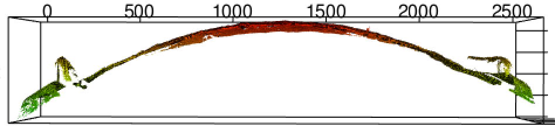
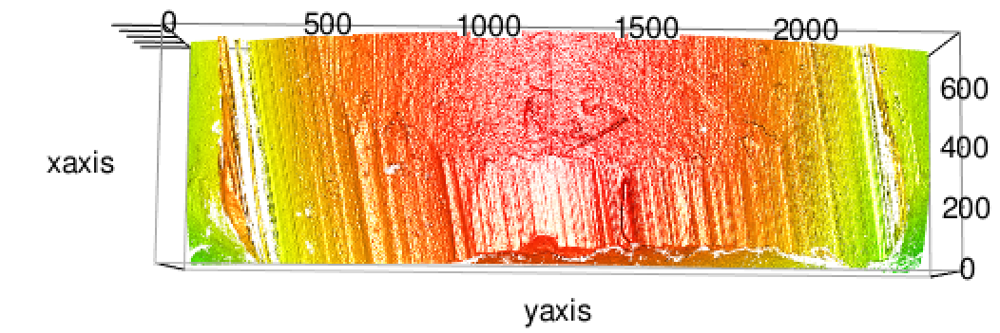

```{r, fig.keep='all', cache=FALSE, echo=FALSE, eval=TRUE, message=F, warning=F}
#rm(list=ls())
#wd <- getwd()
library(extrafont)
library(knitr)
imgdir <- "Figure/"
codedir <- "code"
datadir <- "app/images/Hamby252_3DX3P1of2/"

options(replace.assign=TRUE,scipen=3, digits=2)
bstats <- read.csv("data-25-25/bullet-stats-old.csv")

scrubPath <- function(x) {
  splits <- strsplit(as.character(x), split="/")
  last <- sapply(splits, function(x) x[length(x)])
  gsub(".x3p","", last)
}

library(RColorBrewer)
library(ggplot2)
library(scales)
library(dplyr)
library(x3pr)
library(x3prplus)
library(grid)
library(gridExtra)
library(zoo)
library(tidyr)
library(rpart)
library(rpart.plot)
library(xtable)
library(sm)
library(reshape2)
library(randomForest)
```

### Introduction

Firearm examination is a forensic tool used to determine whether two bullets were fired from the same gun barrel. This process has broad applicability in terms of convictions in the United States criminal justice system. Firearms identification has long been considered an accepted and reliable procedure, but in the past ten years has undergone more significant scrutiny. In 2005, in *United States vs. Green*, the court ruled that the forensic expert could not confirm that the bullet casings came from a specific weapon with certainty, but could merely ``describe" other casings which are similar. Further court cases in the late 2000s expressed caution about the use of firearms identification evidence [@giannelli:2011].

In 2009, the National Academy of Sciences published a report [@NAS:2009] questioning the scientific validity of many forensic methods including firearm examination. The report states that "[m]uch forensic evidence -- including, for example, bite marks and firearm and toolmark identification is introduced in criminal trials without any meaningful scientific validation, determination of error rates, or reliability testing to explain the limits of the discipline."

Rifling, manufacturing defects, and impurities in a barrel create striation marks on the bullet during the firing process. These marks are assumed to be unique to the barrel, as described in a 1992 AFTE article [@afte:1992]. "The theory of identification as it pertains to the comparison of toolmarks enables opinions of common origin to be made when the *unique surface contours* of two toolmarks are in sufficient agreement" The article goes on to state that ``Significance is determined by the comparative examination of two or more sets of surface contour patterns comprised of individual peaks, ridges and furrows."

From a statistical standpoint, identification of the gun that fired the bullet(s) requires that we compare the probabilities of observing matching striae under the competing hypotheses that the gun fired, or did not fire, the crime scene bullet. If indeed the uniqueness assumption is plausible, the latter probability approaches zero.

Current standard practice [@afte:1992] relies in part on the assessment of the so-called maximal number of consecutively matching striae (CMS), first defined by @biasotti:1959.
One of the problems is that a human inspection to determine CMS is subjective [@miller:1998].

Here, we focus on the question of defining what constitutes a match, since there is no agreement in the forensics community. We propose a framework which allows for the automatic analysis of the surface topologies of bullets, and the transcription of the individual characteristics into a 2D plotting framework. 
This allows for an objective and quantitative assessment of striae-based bullet matches.

Throughout this paper, we work with images from the James Hamby Consecutively Rifled Ruger Barrel Study [@hamby:2009]. Ten consecutively rifled Ruger P-85 pistol barrels were obtained from the manufacturer and fired to produce 20 known test bullets and 15 unknown bullets for comparison. 
3D topographical images of each bullet were obtained using a NanoFocus lens at 20x magnification and made publicly available on the NIST Ballistics Database Project\footnote{\url{http://www.nist.gov/forensics/ballisticsdb/hamby-consecutively-rifled-barrels.cfm}} in a format called x3p (XML 3-D Surface Profile). The x3p format conforms to the ISO5436-2 standard\footnote{\url{http://sourceforge.net/p/open-gps/mwiki/X3p/}}, implemented to provide a simple and standard conforming way to exchange 2D and 3D profile data. It was adopted by the OpenFMC (Open Forensic Metrology Consortium\footnote{\url{http://www.openfmc.org/}}), a group of academic, industry, and government firearm forensics researchers whose aim is to establish best practices for researchers using metrology in forensic science.

```{r sidex3p, echo=FALSE, fig.align='center', fig.cap='View of the data along the circumference of the bullet (circular segment of about 30 degrees).'}

```

```{r topx3p, echo=FALSE, fig.align='center', fig.cap='Frontal view of a bullet land (lower end of the view is the bottom of the bullet).'}

```

```{r, echo=FALSE}
typical_width <- read.csv("csvs/grooves.csv") %>%
    summarise(length = mean(groove_right - groove_left)) %>%
    as.numeric %>%
    round(digits = 2)
```

Each fired bullet is provided in the form of a set of six x3p files, where each file is a surface scan between adjacent grooves on the bullet, called a "land". In the Hamby data, typical length (groove-to-groove) of a land is about `r typical_width` micrometers or `r typical_width / 1000` millimeters. For notational simplicity, we refer to a particular land of some bullet as bullet X-Y, where X is the bullet identifier, and Y is the land number. An example of plotting one of these lands is given in Figures \ref{fig:sidex3p} and \ref{fig:topx3p}. These figures show side and top profiles of the land respectively. The tilt of the lines to the left in Figure \ref{fig:topx3p} is not an artifact, but a direct and expected consequence of the spin induced by the rifling during the firing process. Depending on whether a barrel is rifled clockwise or counter-clockwise, the striations have a left or right tilt. The direction of the rifling is a class characteristic, i.e.\ a feature that pertains to a particular class of firearms, and is not unique at the individual barrel/bullet level.

The typical number and width of striation markings on bullets varies significantly depending on the gun barrel. For instance, a Smith and Wesson barrel with a land-width of 2.4 millimeters contained an average 60 striae, with an average width of about 0.08 millimeters [@chu:2011].

The purpose of our paper is to present an automatic matching routine that allows for a completely objective assessment of the quality of a match. Our algorithm is fully open source and available on GitHub [@x3prplus]. This transparency allows for a greater understanding of the individual steps involved in the bullet matching process, and allows other forensic examiners, as well as outside observers, examine the factors that separate known bullet matches from non-matches. We have chosen to perform the matching on a land-to-land level, rather than bullet-to-bullet. Although doing so introduces an implicit assumption of independence between lands, assuming independence only serves to make the task more challenging.
The original paper on the complete Hamby study already reports the successful use of several computer-assisted methods; aside from a zero false positive rate, no further details on a false-negative error rate for bullets are given nor are error rates for land-to-land matches mentioned. 
% Hamby study: automated systems were successfully used for matching:
%  Intelligent Automation's SciClops - Dr. Ben Bachrach (Maryland, United States);
% Automated Land Identification System (ALIS) - Mr. Tsuneo Uchiyama (Tokyo, Japan);
% Integrated Ballistics Identification System (IBIS) – Mr. Robert Thompson (California, United States);
% BulletTRAX-3DTM - Forensic Technology Scientists (Montreal, Canada) (2 sets)
 
A procedure for bullet matching using the BulletTrax3D system is described in @roberge:2006. This study is based on another set of ten consecutively rifled barrels; matches are identified based on a bullet-to-bullet correlation score. The authors state that this process `could be automated', but no implementation of the algorithm is available. Modern automated techniques using 3D images have also been conducted by @riva:2014, but this work applies to striae found on cartridge cases and not bullets.

The remainder of this paper is structured as follows: We first discuss two methods of modeling the class structure of the bullet surfaces. %We then describe a web application for visualizing and working with bullet surfaces. 
We then proceed to describing an automatic matching routine which we evaluate on the bullets made available through the Hamby study.

### Bullet signatures

#### Identifying groove locations

#### Removing curvature

### Automatic matching

#### Algorithm

#### Horizontal alignment

#### Impact of bullet height

#### Varying smoothing factor

### Evaluation

### Conclusion

### Appendix

#### Cylindrical Fit

#### Assessing cross-correlation between signatures at multiple levels of height

#### Signature intensities

#### Complete evaluation of the Hamby study

#### Table of feature importance
