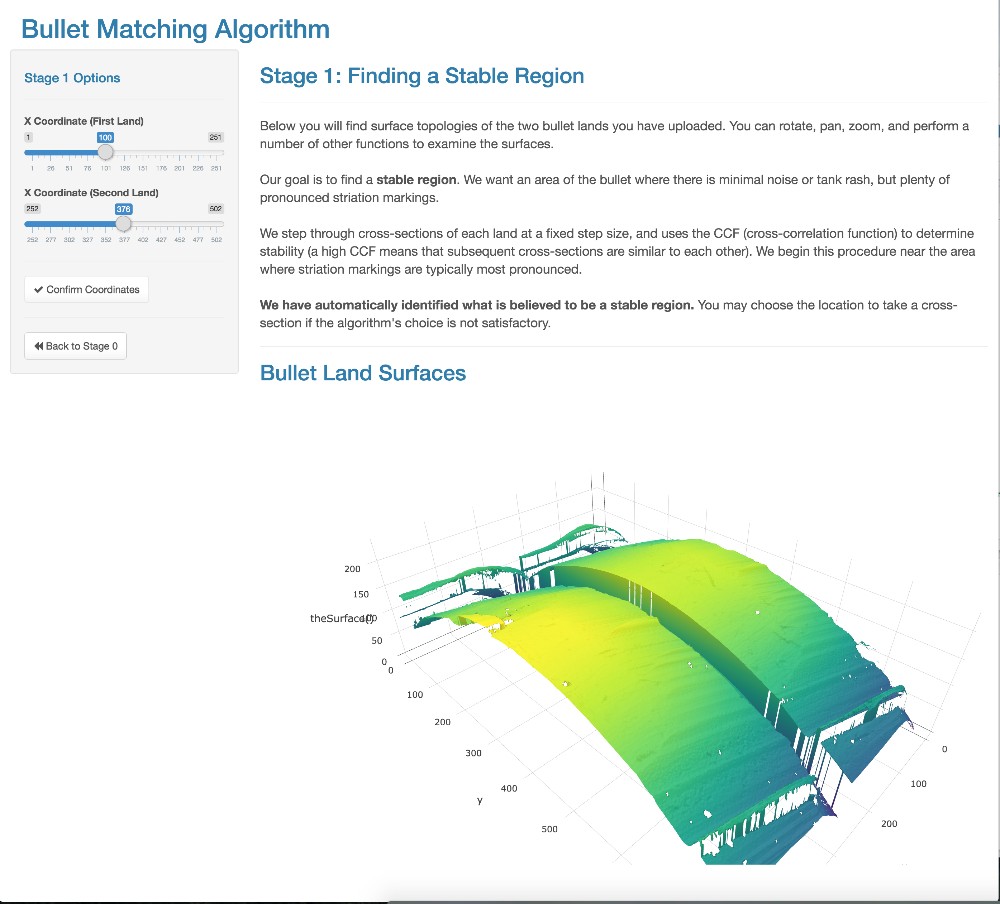

\newpage

# Introduction

There are few stakes higher than the prosecution of suspects in the criminal justice system. In the United States, 32 states continue to maintain the use of the capital punishment, in which a convicted suspect can have their life ended. All 50 states will consider a lifetime imprisonment, with no opportunity for parole, given the extent of the crime committed. And yet, in spite of the major stakes, many forensic science methods have come under fire in recent years due to a lack of statistical rigor. The issues were well summarized in a report by the President's Council of Advisors on Science on Technology (PCAST) [@pcast2016]. A nonexhaustive list of the issues:

- Fingerprint analysis is a subjective process where investigators can be swayed, and error rates are seriously lacking.
- Bitemark analysis is seen as a method that probably can't be developed into a scientifically valid method, and resources towards such efforts should be minimal.
- DNA analysis, while more sound, sometimes discounts the role of operator error in the process.

There was also a heavy focus on the limitations of firearms analysis. Though a widely used and accepted procedure, it has come under particular scrutiny in the past decade. In 2005, in *United States vs. Green*, the court ruled that the forensic expert could not confirm that the bullet casings came from a specific weapon with certainty, but could merely ``describe" other casings which are similar. Further court cases in the late 2000s expressed caution about the use of firearms identification evidence [@giannelli:2011]. In 2009, the National Academy of Sciences published a report [@NAS:2009] questioning the scientific validity of many forensic methods including firearm examination. The report states that "[m]uch forensic evidence -- including, for example, bite marks and firearm and toolmark identification is introduced in criminal trials without any meaningful scientific validation, determination of error rates, or reliability testing to explain the limits of the discipline." The PCAST report corroborated these findings, and explained how modern techniques could potentially be used to turn this analysis into something more objective:

*A second—and more important—direction is (as with latent print analysis) to convert firearms analysis from a subjective method to an objective method. This would involve developing and testing image-analysis algorithms for comparing the similarity of tool marks on bullets. There have already been encouraging steps toward this goal. Recent efforts to characterize 3D images of bullets have used statistical and machine learning methods to construct a quantitative “signature” for each bullet that can be used for comparisons across samples.*
    
## Bullet Matching
    
In the United States, suspects are considered innocent until proven guilty "beyond a reasonable doubt". This in many ways parallels traditional hypothesis testing approaches, in which a pre-defined cut-off (significance level) is used to determine the threshold at which the null hypothesis is rejected (which presumably should occur once the evidence leads us beyond a reasonable doubt). 

Rifling, manufacturing defects, and impurities in a barrel create striation marks on the bullet during the firing process. These marks are assumed to be unique to the barrel, as described in a 1992 AFTE article [@afte:1992]. Current standard practice for bullet matching relies in part on the assessment of the so-called maximum number of consecutively matching striae (CMS), first defined by @biasotti:1959. One of the primary issues with this procedure is that a human inspection to determine CMS is subjective [@miller:1998]. Human inspection also requires on-site analysis of the bullets, which can be costly and time-consuming, and introduces the potential for differing opinions across different forensic examiners.

A modern development in this realm is the adoption of an open format for storing 3D topographical images of bullets in a format called x3p (XML 3-D Surface Profile). The x3p format conforms to the ISO5436-2 standard\footnote{\url{http://sourceforge.net/p/open-gps/mwiki/X3p/}}, implemented to provide a simple and standard conforming way to exchange 2D and 3D profile data. It was adopted by the OpenFMC (Open Forensic Metrology Consortium\footnote{\url{http://www.openfmc.org/}}), a group of academic, industry, and government firearm forensics researchers whose aim is to establish best practices for researchers using metrology in forensic science. Furthermore, NIST (the National Institute for Standards and Technology) is developing a database to allow searching and downloading of these x3p files\footnote{\url{https://tsapps.nist.gov/NRBTD/}}. Although limited to around 70 bullets at the time of this writing, this database in conjuction with open-source software to work with .x3p files opens up a whole new set of possibilities in terms of a statistical foundation for bullet matching.

The feasibility of creating a database of ballistic images that could be used to identify guns used in crimes was evaluated in a 2008 report by the National Research Council [@nap:2008]. The evaluation investigated the scalability of NIBIN (National Integrated Ballistic Information Network), which uses proprietary matching algorithms provided by IBIS. The bottom line of the report was that in spite of the many technical and practical hurdles, solutions to all but one problem could be found. The problem that remained is that statistically, the quality of the matching algorithm (in this case, of breech-face marks and firing pin impressions) could not withstand a hugely increased number of records while still maintaining a reasonable workload for forensic examiners, who have to examine possible matches suggested by the system.

We have several broad goals in developing a modern statistical matching algorithm. First, we wish to define every statistic or measure used objectively. Second, we will make the definitions and code open-source and publicly accessible so that its open for review by forensic scientists and statisticians alike. Third, we will investigate the distributional properties of these statistics across the available universe of bullets accessible to us in the database. Finally, we wish to provide an easy-to-use interface to serve as a front-end for the algorithm.

Critical to the success of a matching algorithm is the extraction of a set of features describing a bullet signature. In addition to the aforementioned CMS, the CCF is used, as it has for other bullet matching applications [@vorburger:2011]. Traditional bullet matching methods have used strict cutoffs (for instance, 6 CMS) to determine a match versus a non-match. We are aiming to be more robust in using a number of features and deriving conditional probabilities of matches given particular values of these features.

* *CCF*: Function of the optimum shift distance measuring the correlation between two profiles [@vorburger:2011]
* *CMS*: Striated markings that line up exactly with one another without a break or dissimilarity in between them [@biasotti:1959, @thompson:2013]. This and other forensic science papers using CMS typically count a single peak as a striae, while we count peaks and valleys, so our definition typically yields CMS values about twice those commonly found in the literature.
* *CMNS*: Striated markings that do not line up exactly with another, without matching striation between them.
* *Matches*: The number of matches between two signatures
* *Non-Matches*: The number of matches between two signatures
* *D* = $\sqrt{\frac{1}{\text{\#}t}\sum_t \left[f(t) - g(t)\right]^2}$ where $f(t)$ and $g(t)$ are aligned signatures. The euclidean vertical distance between surface measurements of aligned signatures. This is a measure of the total variation between two profiles [@clarkson1933definitions].
* *S*: The sum $S$ of average absolute heights of matched extrema: for each of the two matched stria, compute the average of the absolute heights of the peaks or valleys. $S$ is then defined as the sum of all these averages.  

With this in mind, we have developed an automated matching routine, written in R, which uses open and transparent statistical techniques to arrive at a predicted probability of a match at the bullet land level. This framework is provided as an R package called x3prplus [@x3prplus] with an associated web front-end. The web front-end allows forensic examiners to upload bullet land images, examine the surface topologies, and perform each aspect of the algorithm in order to arrive at a probability of a match. The final display includes a results page in which all chosen parameters of the algorithm are provided so that a report on the results can be pretended and cross-checked by other researchers. Figure \@ref(fig:bullets-app). displays a prototype user interface for this algorithm.

```{r bullets-app, echo=FALSE, fig.cap='Prototype user interface for the bullet matching algorithm.', fig.pos='H'}

```

This is not the first automatic bullet matching system [@xie:2009, @riva:2014, @bachrach:2002]. But it builds on strong research principles by using a publicly accessible database, including fully reproducible results, and using a broad set of derived features to produce probabilities or scores based on a machine learning algorithm. 

This work has been submitted and accepted (with revisions) by the Annals of Applied Statistics. We are following up by investigating the properties of different features as applied to degraded bullets, and when compared with common cut-offs for match, non-match, and inconclusive from the literature. In particular, because a real world scenario often involves recovering only a fragment of the bullet from a crime scene, many of the traditional features such as CMS need generalizations that handle these cases. Furthermore, there is an open question regarding precisely the size of the fragment needed in order to be confident of a match "beyond a reasonable doubt". This warrants further investigation.

## Computing Tools for Bullet Matching

Conveniently, the computing revolution has opened up statistical methods and tools to a broad range of fields, and these tools can be used to begin such an image analysis algorithm. With the growing popularity of R [@R] in particular, the wide range of choices of open source statistical routines in the form of packages has significantly expanded statistical computing capabilities. 

Still, there remains a fundamental obstacle to the use of R. Effective use of R requires a commitment to learning and understanding programming, which some in the forensic science community may not have the desire to do so. Furthermore, although the open-source nature of R is one of its biggest assets, it also means that there is a more rapid development cycle than would often be found in more corporate software solutions. This means that R developers must continue to maintain their code while learning new programming concepts.

A number of tools have been developed in an attempt to address this issue. The commercial software on which R is derived, S-PLUS [@SPlus], includes a rudimentary graphical user interface (GUI) supporting data editing, graphing, and basic statistics. Over time, GUIs were developed for R as well. One of the first was R Commander [@fox2005], which provides a wrap-around user interface for R. With drop-down menus allowing point-and-click selection of a number of common data analysis and statistical functions, analysis could be performed without a knowledge of programming. More recently, the program Deducer [@fellows2012] also abstracts the programming into graphical menus and buttons. It expands on R Commander by providing an effective data viewer, help system, and easy to read tables displaying the results.

GUIs have some natural limitations that often make them a less appealing option for researchers. The results of an analysis from a GUI are not typically reproducible. Whereas an R script can be created, shared, and executed elsewhere, the actions taken in a GUI are not transcribed and portable. GUIs also tend to slow down the development and iteration process once the user has become more comfortable with the programming concepts. For instance, scripts allow copying and pasting of code blocks that need only minor modifications. In a GUI, the options representing a code block would need to be individually chosen through drop-down menus.

Recognizing some of these limitations, other approaches have been taken to easing the transition to working with R. RStudio [@RStudio] provides a GUI around R with expanded functionality, but maintains focus on the scripting and coding aspect. In this sense, RStudio more readily resembles an IDE (Integrated Development Environment), which aid the programmer rather than attempting to abstract the programming away. While this allows reproducibility and may still help a less experienced programmer begin to get started in a programming language, it still depends on a continuing effort to learn programming.

The Shiny package for R provides a framework for researchers who fall in set 2 to provide a service to those in set 3. Shiny [@shiny] is a web development framework which can help turn the results of an R analysis into an interactive web application. Results can be generated by browsing to the website at which the Shiny application is deployed, and using GUI elements (drop-downs, text boxes, tabs) similar to R Commander or Deducer in order to generate results. But a Shiny application is standard R code, and hence maintains the reproducibility and maintainability benefits of standard R scripts.

Because Shiny offers a solution which maintains the benefits of both GUIs and standard programming, I believe it can form the basis for a new set of tools and concepts that greatly expand the reach of statistics. Those who are comfortable with programming can now provide functionality to those who aren't. This functionality can enable researchers to see, understand, and work with their data in ways that they were simply unable to. Ultimately, an open-source solution based on R and Shiny I believe can yield a bullet matching framework which allows for iteration and improvement, but doesn't shut out individuals lacking a knowledge of or a desire to learn programming.

## Visual Inference for Bullet Matching

A major aspect of exploratory data analysis is producing graphical displays, which help draw attention to patterns in data. Graphical displays are even used for model assessment [@Gelman:2004gg]. Ultimately, a graphical display is a statistic, or some function of the data. Unlike a traditional hypothesis test setting, however, a graphical display does not have a clearly defined reference distribution from which comparisons can be made (contrast this with, for instance, a statistic such as the sample mean for large samples which is asymptotically normally distributed under regularity conditions) This makes the identification of "significant" features of a graphical display far more challenging.

In a traditional hypothesis test, a relevant test statistic is stated and its distribution is derived under an assumed given null hypothesis. Typically, a significance level $\alpha$ for the test is selected, often $.05$. If the probability of obtaining a test statistic under the null hypothesis as or more extreme than the observed test statistic from the data is less than $\alpha$, we conclude that the null hypothesis should be rejected. Note that we are directly fixing a significance level, and thus fixing the Type I Error, or the probability of rejecting the null hypothesis given that the null hypothesis was in fact true. Of practical importance is the power of the test. The power is the probability that we will reject the null hypothesis given that it is false, as we should. Taking the value of the power as $p$, $1 - p$ will yield the Type II Error rate, the probability of failing to reject the null hypothesis when in fact the null hypothesis is false.

The lineup protocol is an inferential framework which acts as an exploratory data analysis corollary to traditional hypothesis testing [@buja2009statistical]. The key idea is recognizing the parallel between discoveries in a graphical display and rejection of a null hypothesis in a traditional hypothesis test. In the universe of possible discoveries which are not pre-specified, one that is identified is a test statistic that resulted in rejection. The concept extends to null plots, which represent the visual inference corollary to null distributions in traditional hypothesis testing. Null plots are a possibly infinite set of displays that are randomly generated by sampling from the null hypothesis. By placing a target plot within a set of $m$ null plots and asking observers to identify the "most different" plot, a visual inference test can be conducted (See Figure \@ref(fig:lineup) for an example). As in the hypothesis testing framework, a significance level $\alpha$ is typically pre-specified. Note however that this cannot be controlled exactly because of the discrete number of plots shown in a lineup [@Majumder:2013ie]. By increasing the number of observers, however, this can be made arbitrarily small. Power and Type II Error can also be computed, but because observers have differing levels of ability, the observer skill must be estimated by aggregating the overall results across a number of lineups from each observer. One interesting aspect of visual inference when compared with traditional hypothesis testing is the case of an observer identifying the correct plot for the wrong reason. In this scenario, the aforementioned "discovery" doesn't correspond to the feature being tested. This is why visual inference tests ask for the reason an observer selected a particular display.

```{r lineup, echo=FALSE, fig.cap='An example of a lineup from the perspective of an observer.', fig.pos='H'}
knitr::include_graphics(rep("images/lineup.png"))
```

This protocol has been applied to a wide variety of situations. It has been used in order to identify the features of Q-Q plots which are most relevant, in particular to show that in certain cases detrended Q-Q plots are more powerful than their trended counterparts [@Loy:2016dqa]. Lineups have been shown to compare favorably with more traditional tests in the context of a linear model as well. @Majumder:2013ie demonstrated this, as well as showing that there are cases in which visual tests yield higher power than traditional tests, such as when the effect size is large. Lineups have also been used to assess the power of competing graphical designs [@Hofmann:tvcg:12].

As part of this work, a web framework was developed in order to conduct lineup studies on Amazon Mechanical Turk [@majumder2013]. This framework has been a significant development in visual inference research, enabling experiments\footnote{\url{http://www.public.iastate.edu/~hofmann/experiments.html}} such as:

* Diagnostics for hierarchical linear models
* Testing for expression difference in RNA-Seq data
* Variations of Q-Q plots
* The Sine Illusion

The basic limitation of this current framework is its accessibility to researchers. While studies could be deployed, the process involved manually modifying a repository of PHP files and defining the relevant randomization schemes in PHP code. With the broad applicability of the lineup protocol, it is important that a service like this be available to all, not just those with the requisite programming skills. Hence, we have begun the development of a modernization of this framework which allows researchers to more seamlessly deploy studies, while automatically deriving the distribution of the test statistic of interest based on the blocking factors of the lineups used. As part of my work, I intend to work with Dr. Cook, Dr. Hofmann, and others, in order to focus on much of the underlying theory in cases where the distribution of null plots is not as easily defined, or multiple factors are varied in a single lineup. Researchers will then be able to use their own data to develop lineup studies, with observers recruited according to the demographics needed. A prototype user interface is shown in Figure \@ref(fig:lineups-app).

```{r lineups-app, echo=FALSE, fig.align='center', fig.cap='Prototype user interface for the lineups web application.', fig.pos='H'}
knitr::include_graphics(rep("images/lineups_app.png"))
```

Using an interface similar to this prototype, researchers and scientists will be able to define the parameters of the experiment (number of lineups, randomization scheme, strata, etc.), upload the lineups generated from package `nullabor` [@nullabor], recruit observers, and obtain the results of the experiment seamlessly. We have already successfully deployed lineup studies using a portion of this framework. We have modernized the aforementioned PHP framework to an R and Shiny based scheme which can be easily deployed. The next steps are the administration and service side, so that researchers can create these studies without the current manual process that is necessary. 

\newpage

# Automatic Matching of Bullet Lands

*This work is part of the Center for Statistics and Applications in Forensic Evidence. It is joint work with Dr. Heike Hofmann and Dr. Alicia Carriquiry. The paper is titled **Automatic Matching of Bullet Lands** and has been accepted with revisions by the Annals of Applied Statistics. The revision has been submitted to the journal.*

```{r, child='papers/bullets/imaging-paper.Rmd'}

```

# Explorations in Matching Degraded Bullets

*This work is in progress*

## Introduction

## Background + Current state of algorithm

## Degraded Bullets

## Feature Comparison

## Conclusion

\newpage

# A Visual Inference Framework for Graphical Tests with a Case Study in Bullet Signatures

*This work is in progress*

## Introduction to Visual Inference

## Background (Current study deployment methods)

## New Framework

### Observers

### Researchers

## Limitations/Future Work

## Conclusion

# Future Work

# References
